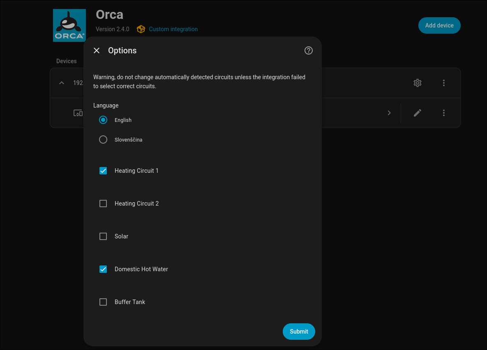

## Home Assistant integration with Orca Energy 
Home Assistant Integration for Orca Energy Heat Pump. It supports models Mono and Duo with various configurations (floor, radiators, solar, DHW).

After installing and configuring the integration, [follow these instructions to import the dashboard](dashboards/)

## Requirements
Orca Heat Pump should be accessible via network by HA. First test your access by connecting to http://{ip_addr_of_orca_hp}. Depending on firmware version, you might see either password prompt or just a generic landing page.

## Installation
1. Add Integration  
    A.  When using HACS add this repository as custom repository by opening HACS, select Integrations, press the three dots in the upper right corner, select Custom Repositories and add https://github.com/Tomasinjo/orca-energy-ha as new repository. Install it by pressing button right button "Explore & Download Repositories", search for "orca" and select "Orca Engery Heat Pump".

    B.  Without HACS, copy folder orca-ha to your custom_components directory, which is usually located in /config directory.

2. Go to Settings -> Devices & Services -> + Add Integration -> Search for "Orca".
Configure integration using admin/admin, and domain name or IP address of Orca Heat Pump.

## Measuring power
Orca heat pump does not provide this information, but can be easily done with cheap 3-phase power meter and ESPHome. Check out [measuring_power_consumption](measuring_power_consumption/).

## Contributing
Read [Development resources](development_resources/).

## Circuit setup detection
The integration attempts to recognize specific circuit configuration of your heat pump. While it usually works, it is possible that lack of certain sensors cause integration to miss a circuit. If that happens, you can manually add missing circuit yourself by re-configuring integration:  

Automatically detected circuits will be checked in advance and you can manually add missing circuits.  
